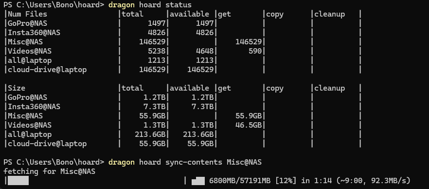
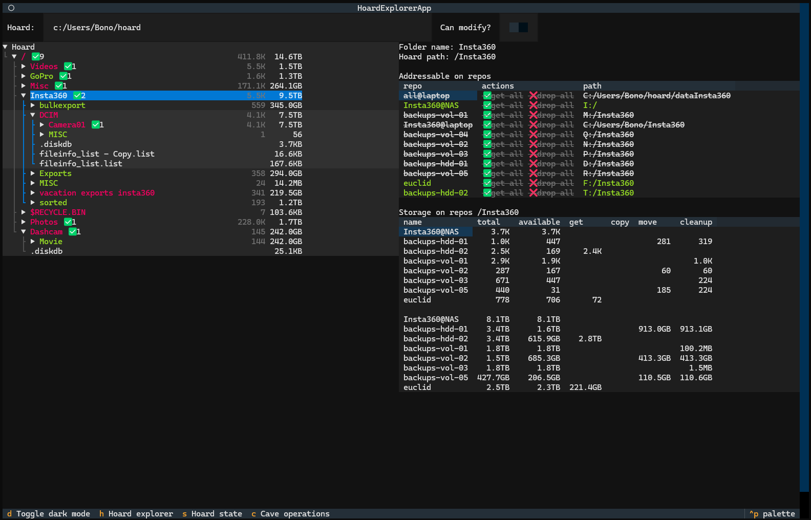
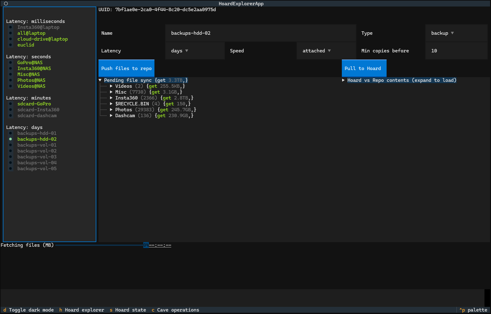

# Motivation

Through no fault of my own I have found myself tending to a hoarding forest that has been growing for some years now.

I have a bunch of storage devices (shown on the right) that I want to keep in sync, and on the left is where they
logically belong. Needless to say, none of the devices are large enough to contain everything (although the NAS comes
close ... for now), but also each device contains some of the data in the hoard, and has a purpose.

Keeping all of that in sync is a small nightmare.

Alternatives that turned out to be insufficient:

- Sure, a bunch of [rsync](https://linux.die.net/man/1/rsync) scripts could handle it ... for now, at least. That is not
  scalable, however, and a peculiar
  problem presents itself with the set of backups. I don't want to necessarily manage 10 or more HDDs/SSDs that contain
  the backups of all the data, and manually split where each sub-folder goes.
- [git-annex](https://git-annex.branchable.com/) is magical and powerful but inflexible ... and slow for large
  repositories on
  Windows with >100k files... and utterly confusing as to
  what exactly is happening at each instant in time, making it frustrating to deal with on a daily basis. Even with
  partial checkouts, its insistence to put everything in the same hierarchy and touching the actual files to convert to
  symlinks is very inconsiderate and incompatible with many workflows, e.g. if you rely on modification times for
  anything.
- [bup](https://bup.github.io/) and other backup solutions would solve the incremental backup problem, but not the
  i-can't-fit-all-my-data-in-one-place problem, and the fact that backups are written in a custom format, rather than in
  folders, is locking it into relying on a piece of software that may or may not last.
- [AnyBackup](https://anybackup.sourceforge.net/) is the closest I have found to my requirements, but again is
  inflexible in requiring the folder structure to be fixed, as well as not supporting some QoL features as incoming
  repositories (e.g. SD cards from cameras).

There has got to be a better way, and [**Dragon**](https://github.com/madcowbg/dragon) is that way.

## Promises

- future-proof - all data is in plain filesystems, no recovery solutions needed to get it out should you choose to.
- ubiquitous - all of your data is merged logically into a single hierarchy, yet can manifest partially in separate
  locations, so it is compatible with basically any usage of that data.
- powerful - one-click sync, and backup with multiple copies.
- local - cloud services are not needed - but supported as repo locations.

## Un-goals

- file versioning - too complex to spat-chock as it defies the filesystem abstraction. Suggested workaround: store a Git
  repo or TimeMachine in hoard.

# Usage

`dragon hoard contents status` - creates a table summarizing the status of the current hoard, and what each repo is
currently sheduled to get, copy and cleanup.

`dragon hoard contents pull REPO` - execute pull of the contents of `REPO`, so that we can determine what we want to put
in the hoard and what to discard.

`dragon hoard files push REPO` - execute file synchronization between repositories, aiming to fill `REPO` with all
files that it requests to get or copy.

`dragon hoard gui` - runs a Textual-based GUI exploring a hoard's contents.

# Screenshots

Hoard explorer GUI - showing all the files that are being tracked.

Cave operations GUI - showing what sync operations are scheduled to be executed.

